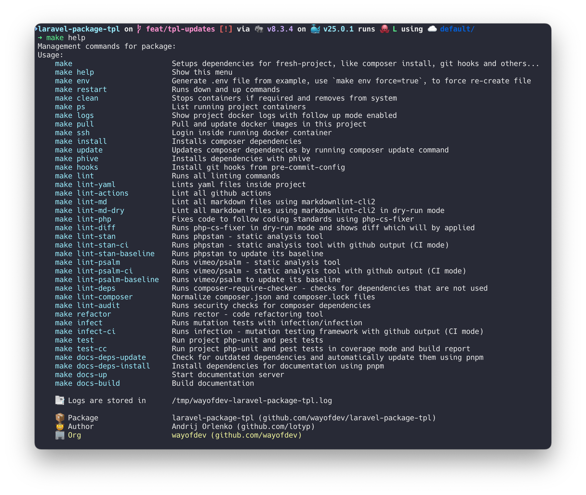

<p align="center">
    <br>
    <a href="https://wayof.dev" target="_blank">
        <picture>
            <source media="(prefers-color-scheme: dark)" srcset="https://raw.githubusercontent.com/wayofdev/.github/master/assets/logo.gh-dark-mode-only.png">
            
        </picture>
    </a>
    <br>
</p>

<p align="center">
    <strong>Build</strong><br>
    <a href="https://github.com/wayofdev/laravel-paginator/actions" target="_blank"></a>
</p>
<p align="center">
    <strong>Project</strong><br>
    <a href="https://packagist.org/packages/wayofdev/laravel-paginator" target="_blank"></a>
    <a href="https://packagist.org/packages/wayofdev/laravel-paginator" target="_blank"></a>
    <a href="https://packagist.org/packages/wayofdev/laravel-paginator" target="_blank"></a>
    <a href="https://packagist.org/packages/wayofdev/laravel-paginator" target="_blank"></a>
</p>
<p align="center">
    <strong>Quality</strong><br>
    <a href="https://app.codecov.io/gh/wayofdev/laravel-paginator" target="_blank"></a>
    <a href="https://dashboard.stryker-mutator.io/reports/github.com/wayofdev/laravel-paginator/master" target="_blank"></a>
    <a href=""></a>
</p>
<p align="center">
    <strong>Community</strong><br>
    <a href="https://discord.gg/CE3TcCC5vr" target="_blank"></a>
    <a href="https://x.com/intent/follow?screen_name=wayofdev" target="_blank"></a>
</p>

<br>

# Laravel Paginator

This is minimal Laravel template which is used by other PHP projects in wayofdev organization.

If you **like/use** this package, please consider **starring** it. Thanks!



## 💿 Installation

### → Using composer

Require as dependency:

```bash
composer req wayofdev/laravel-paginator
```

<br>

## 🧪 Running Tests

### → PHPUnit tests

To run tests, run the following command:

```bash
make test
```

### → Static Analysis

Code quality using PHPStan:

```bash
make stan
```

### → Coding Standards Fixing

Fix code using The PHP Coding Standards Fixer (PHP CS Fixer) to follow our standards:

```bash
make cs-fix
```

<br>

## 🤝 License

[](./LICENSE.md)

<br>

## 🙆🏼‍♂️ Author Information

Created in **2022** by [lotyp / wayofdev](https://github.com/wayofdev)

<br>
